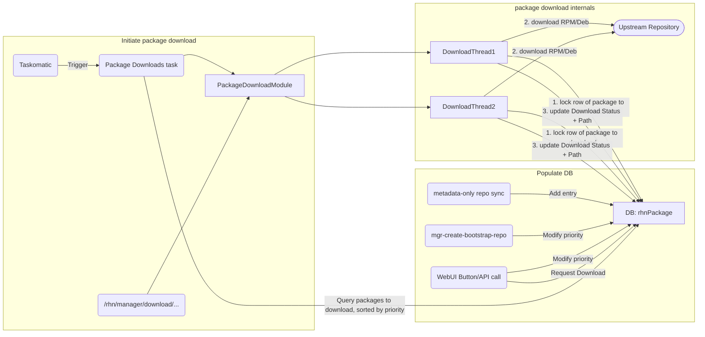
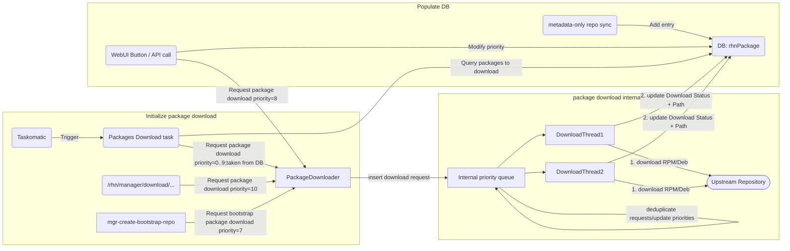

# Diagrams

## Ricardo

```mermaid
flowchart LR

    subgraph Populate DB
    reposync(metadata-only repo sync) -->|Add entry| rhnPackage[DB: rhnPackage]
    createBootstrap(mgr-create-bootstrap-repo) -->|Modify priority| rhnPackage
    webui(WebUI Button/API call) -->|Modify priority| rhnPackage
    webui -->|Request Download| rhnPackage
    end
    
    subgraph Initiate package download
    Taskomatic(Taskomatic) -->|Trigger| Task(Package Downloads task)
    Task -->|Query packages to download, sorted by priority|rhnPackage
    Task -->PackageDownloadModule
    PackageDownloadEndpoint(/rhn/manager/download/...) --> PackageDownloadModule
    end

    subgraph package download internals
    PackageDownloadModule --> DownloadThread1
    PackageDownloadModule --> DownloadThread2
    
    DownloadThread1 -->|1. lock row of package to download|rhnPackage
    DownloadThread1 -->|2. download RPM/Deb| Upstream([Upstream Repository])
    DownloadThread1 -->|3. update Download Status + Path| rhnPackage
    
    DownloadThread2 -->|1. lock row of package to download|rhnPackage
    DownloadThread2 -->|2. download RPM/Deb| Upstream([Upstream Repository])
    DownloadThread2 -->|3. update Download Status + Path| rhnPackage
    
    end 
```

## Alex

```mermaid
flowchart LR
    subgraph Populate DB
    reposync(metadata-only repo sync) -->|Add entry| rhnPackage
    webui-->|Modify priority| rhnPackage
    end

    subgraph Initialize package download
    Taskomatic(Taskomatic) -->|Trigger| Task(Packages Download task)
    Task -->|Query packages to download|rhnPackage
    Task -->|Request package download priority=0..9;taken from DB| PackageDownloader
    PackageDownloadEndpoint(/rhn/manager/download/...) -->|Request package download priority=10| PackageDownloader
    mgr-create-bootstrap-repo -->|Request bootstrap package download priority=7| PackageDownloader
    webui(WebUI Button / API call) -->|Request package download priority=8| PackageDownloader
    end
    
    subgraph package download internals
    PackageDownloader -->|insert download request| queue[Internal priority queue]
    queue -->|deduplicate requests/update priorities| queue

    queue --> DownloadThread1
    queue --> DownloadThread2
    
    DownloadThread1 -->|1. download RPM/Deb| Upstream([Upstream Repository])
    DownloadThread1 -->|2. update Download Status + Path| rhnPackage(DB: rhnPackage)
    
    DownloadThread2 -->|1. download RPM/Deb| Upstream([Upstream Repository])
    DownloadThread2 -->|2. update Download Status + Path| rhnPackage(DB: rhnPackage)   
    end 
    
```
