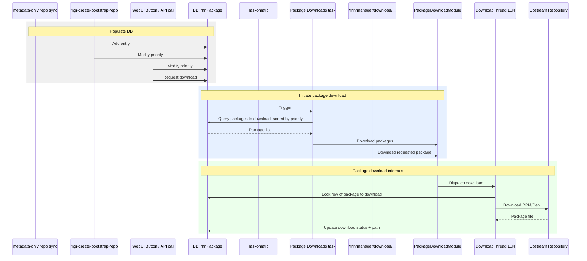
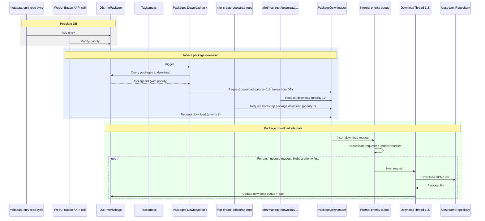

# Diagrams (sequence versions)

## Ricardo

```mermaid
sequenceDiagram
    participant Reposync as metadata-only repo sync
    participant Bootstrap as mgr-create-bootstrap-repo
    participant WebUI as WebUI Button / API call
    participant DB as DB: rhnPackage
    participant Taskomatic
    participant Task as Package Downloads task
    participant Endpoint as /rhn/manager/download/...
    participant Module as PackageDownloadModule
    participant Thread as DownloadThread 1..N
    participant Upstream as Upstream Repository

    rect rgb(240, 240, 240)
    Note over Reposync,DB: Populate DB
    Reposync->>DB: Add entry
    Bootstrap->>DB: Modify priority
    WebUI->>DB: Modify priority
    WebUI->>DB: Request download
    end

    rect rgb(230, 240, 255)
    Note over DB,Module: Initiate package download
    Taskomatic->>Task: Trigger
    Task->>DB: Query packages to download, sorted by priority
    DB-->>Task: Package list
    Task->>Module: Download packages
    Endpoint->>Module: Download requested package
    end

    rect rgb(235, 255, 235)
    Note over DB,Upstream: Package download internals
    Module->>Thread: Dispatch download
    Thread->>DB: Lock row of package to download
    Thread->>Upstream: Download RPM/Deb
    Upstream-->>Thread: Package file
    Thread->>DB: Update download status + path
    end
```

## Alex

```mermaid
sequenceDiagram
    participant Reposync as metadata-only repo sync
    participant WebUI as WebUI Button / API call
    participant DB as DB: rhnPackage
    participant Taskomatic
    participant Task as Packages Download task
    participant Bootstrap as mgr-create-bootstrap-repo
    participant Endpoint as /rhn/manager/download/...
    participant Downloader as PackageDownloader
    participant Queue as Internal priority queue
    participant Thread as DownloadThread 1..N
    participant Upstream as Upstream Repository

    rect rgb(240, 240, 240)
    Note over Reposync,DB: Populate DB
    Reposync->>DB: Add entry
    WebUI->>DB: Modify priority
    end

    rect rgb(230, 240, 255)
    Note over WebUI,Downloader: Initiate package download
    Taskomatic->>Task: Trigger
    Task->>DB: Query packages to download
    DB-->>Task: Package list (with priority)
    Task->>Downloader: Request download (priority 0..9, taken from DB)
    Endpoint->>Downloader: Request download (priority 10)
    Bootstrap->>Downloader: Request bootstrap package download (priority 7)
    WebUI->>Downloader: Request download (priority 8)
    end

    rect rgb(235, 255, 235)
    Note over DB,Upstream: Package download internals
    Downloader->>Queue: Insert download request
    Queue->>Queue: Deduplicate requests / update priorities
    loop For each queued request, highest priority first
        Queue->>Thread: Next request
        Thread->>Upstream: Download RPM/Deb
        Upstream-->>Thread: Package file
        Thread->>DB: Update download status + path
    end
    end
```
